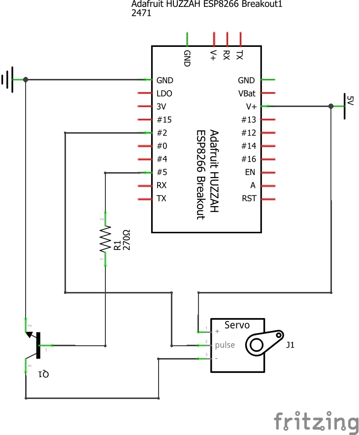

### Configuring the ESP8266

- Flash microPython firmware, instructions here: 
[https://docs.micropython.org/en/latest/esp8266/esp8266/tutorial/intro.html](https://docs.micropython.org/en/latest/esp8266/esp8266/tutorial/intro.html)
- Install ampy: [https://github.com/adafruit/ampy](https://github.com/adafruit/ampy)
- Edit your copy of the `main.py` (in the boot/custom directory), replacing  `<ssid>` and `<psk>`
with your WiFi network name and password, respectively. Edit the MQTTClient call to reflect the settings on your mqtt 
server
- Change the pin number in the Servo() constructor (also in in `main.py`) depending on your setup. Keep in mind you
need to specify the GPIO pin number and these will likely differ from the silkscreen on your ESP8266 board.
- Run `ampy -p <serial port here> put /<path-to-this-directory>/main.py main.py`, and `ampy -p <serial port here> put 
/<path-to-this-directory>/servo.py servo.py`
- Reset the ESP8266 and open a serial connection with a baud rate of `115200` (you can use screen, Tera Term, etc.)

### Physical setup

Unscrew the servo arm you intend to use, and publish the message `2300` to te `test/vent1` topic (or whatever topic 
you have the ESP8266 subscribed to). Move the vent to the closed position, attach your push/pull mechanism to the servo 
arm, and screw the arm into place. This will establish one limit of travel on the servo. You can then experiment with 
values in the 1800-1300 range to find a good limit for fully open. Record that value to use in the thermostat 
application. I've had success with 2300 and 1500 as limits, but your mileage may vary. This is an important step 
since you can easily burn out a servo by sending too long or too short PWM pulses.